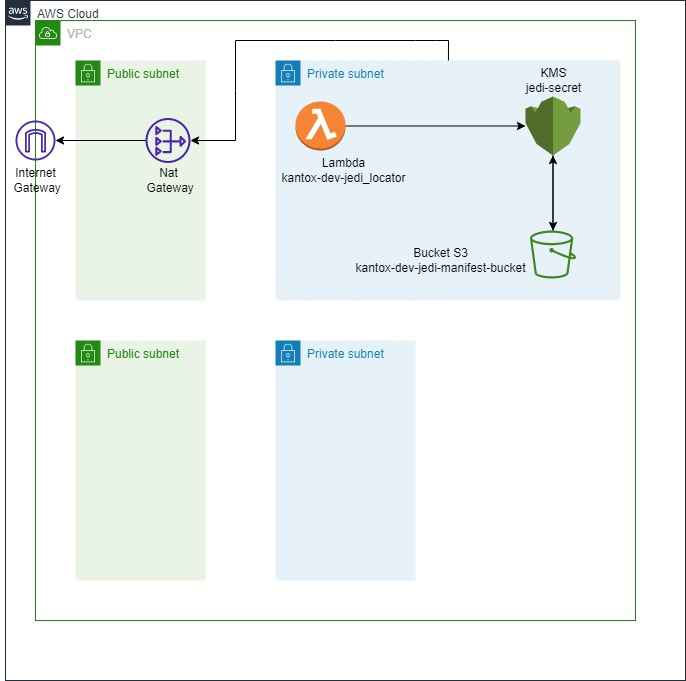

# IaC Terraform

IaC - Despliegue IaC JEDI

Estructura:

```console
terra_jedi
├── backend-terraform
│   ├── main.tf
│   ├── mainvars.tf
│   ├── provider.tf
│   └── version.tf
├── dev
│   ├── LAMBDA
│   │   ├── Code and json
│   │   │   ├── jedi_1.json
│   │   │   ├── jedi_2.json
│   │   │   └── jedi.json
│   │   ├── lambda
│   │   │   ├── node_modules
│   │   │   ├── index.js
│   │   │   ├── lambda.zip
│   │   │   ├── package-lock.json
│   │   │   └── package.json
│   │   ├── lambda_data.tf
│   │   ├── lambda_kms.tf
│   │   ├── lambda_maim.tf
│   │   ├── lambda_outputs.tf
│   │   ├── lambda_role.tf
│   │   ├── lambda_s3.tf
│   │   ├── lambda_variables.tf
│   │   └── lammda.zip
│   ├── VPC
│   │   ├── vpc_igw.tf
│   │   ├── vpc_main.tf
│   │   ├── vpc_ngw.tf
│   │   ├── vpc_outouts.tf
│   │   ├── vpc_rt.tf
│   │   ├── vpc_sg.tf
│   │   └── vpc_variables.tf
│   ├── mainvar.tf
│   ├── modules.tf
│   ├── providers.tf
│   ├── version.tf
│   ├── .gitignore
│   └── README.md
└──
```

***The Jedi Council: Secrets of the Galaxy.**

El directorio `env` contiene las variables (owner, sox, etc) de despliegue que necesite para su proyecto.

customer: En este directorio estan creados los servicios por funcionalidad customer y alli estan --> task definition de MS, Servico de ECS fargate, variables de entorno de task definition, secrets, secret manager, repositorio ECR, politicas de task, politicas de servicio, roles, KMS.

secmanager: En este directorio estan creados los servicios por funcionalidad customer y alli estan --> task definition de MS, Servico de ECS fargate, variables de entorno de task definition, secrets, secret manager, repositorio ECR, politicas de task, politicas de servicio, roles, KMS.

transversal : En este directorio contiene los siguientes recursos transversales a la solución que seran utilizados transversalamente a la funcionalidad, alli se contiene --> Balanceadores NBL y ALB, Target group, listener, KMS y cluster ECS. (todos los recursos macro que se requieren para que los otros servicios existan)

El archivo `main.tf` contiene la lógica de nuestros recursos de infraestructura

**Azure Pipelines**:

- Integración continua (CI)
- Entrega continua (CD)
- Despliegue continuo (CD)


**Diagrama**



```
